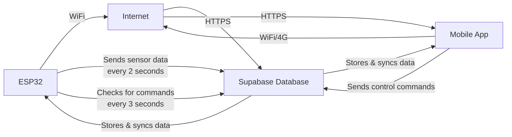

# 📱 How to Connect Your Phone to the App

Your computer's Metro bundler is running at:
- **Local URL**: `exp://127.0.0.1:8081` (only works on this computer)
- **Network URL**: `exp://10.241.196.106:8081` ✅ **USE THIS ONE**

## Steps to Connect Your Phone:

1. **Make sure your phone and computer are on the same WiFi network**

2. **Open Expo Go app** on your Android phone

3. **Tap "Enter URL manually"** at the bottom

4. **Type exactly**:
   ```
   exp://10.241.196.106:8082
   ```

5. **Press "Connect"**

Your app should load in a few seconds!

---

## If It Still Doesn't Work:

### Option 1: Check WiFi
- Both devices must be on the **same WiFi network**
- Turn off mobile data on your phone
- Reconnect to WiFi

### Option 2: Windows Firewall
Run this in PowerShell as Administrator:
```powershell
New-NetFirewallRule -DisplayName "Expo Metro" -Direction Inbound -Action Allow -Protocol TCP -LocalPort 8082
```

### Option 3: Use Android Emulator Instead
If you have Android Studio installed:
1. Start the emulator
2. In the terminal where Metro is running, press `a`

---

## Current Status:
✅ Metro bundler is running in offline mode
✅ No network errors  
✅ Ready to accept connections

**Your connection URL**: `exp://10.241.196.106:8082`

---

# 🔌 How to Connect ESP32 WRROM 32 to the App

## Prerequisites

Before you start, make sure you have:
- ✅ ESP32 WROOM 32 development board
- ✅ USB cable (microUSB or USB-C depending on your board)
- ✅ Arduino IDE installed ([Download here](https://www.arduino.cc/en/software))
- ✅ Sensors and actuators wired up (see `esp32/README.md` for wiring diagram)

## Step 1: Install Arduino IDE and Libraries

1. **Install Arduino IDE** (if not already installed)

2. **Add ESP32 Board Support**:
   - Open Arduino IDE
   - Go to **File → Preferences**
   - In "Additional Board Manager URLs", add:
     ```
     https://dl.espressif.com/dl/package_esp32_index.json
     ```
   - Go to **Tools → Board → Boards Manager**
   - Search for "esp32" and install **"esp32 by Espressif Systems"**

3. **Install Required Libraries**:
   - Go to **Sketch → Include Library → Manage Libraries**
   - Search and install:
     - **ArduinoJson** (version 6.x)
   - WiFi and HTTPClient are built-in, no need to install

## Step 2: Get Your Supabase Credentials

1. **Open Your App** on your phone or emulator

2. **Create a Device** in the app:
   - Go to device settings
   - Click "Add New Device"
   - Copy the **Device ID** (UUID) that's generated

3. **Get Supabase Credentials** from your `app.json`:
   - Open `c:\Users\jacob\OneDrive\Documents\watertank\Albret_UI\app.json`
   - Find your Supabase URL and Anon Key in the `extra` section

## Step 3: Configure ESP32 Code

1. **Navigate to ESP32 folder**:
   ```
   c:\Users\jacob\OneDrive\Documents\watertank\Albret_UI\esp32\water_tank_monitor
   ```

2. **Create config.h file**:
   - Copy `config.h.example` and rename it to `config.h`
   - Or create a new file called `config.h`

3. **Edit config.h** with your credentials:
   ```cpp
   #define WIFI_SSID "Your_WiFi_Name"
   #define WIFI_PASSWORD "Your_WiFi_Password"
   
   #define SUPABASE_URL "https://your-project.supabase.co"
   #define SUPABASE_ANON_KEY "your-supabase-anon-key"
   
   #define DEVICE_ID "device-uuid-from-app"
   ```

   ⚠️ **Important**: 
   - Use 2.4GHz WiFi only (ESP32 doesn't support 5GHz)
   - Same WiFi network as your computer/phone

## Step 4: Upload Code to ESP32

1. **Connect ESP32** to your computer via USB

2. **Open Arduino IDE**:
   - Open `water_tank_monitor.ino`

3. **Configure Board Settings**:
   - Go to **Tools → Board → ESP32 Arduino**
   - Select **"ESP32 Dev Module"**
   
4. **Select Port**:
   - Go to **Tools → Port**
   - Select the COM port your ESP32 is connected to (e.g., COM3, COM4)
   - If you don't see any port:
     - Install CH340/CP2102 USB driver (Google your ESP32 board model)
     - Try a different USB cable

5. **Upload**:
   - Click the **Upload button** (→ arrow icon)
   - Wait for "Done uploading" message

## Step 5: Verify Connection

1. **Open Serial Monitor**:
   - Go to **Tools → Serial Monitor**
   - Set baud rate to **115200**
   - Press **EN/RST button** on ESP32 to restart

2. **Check Output**:
   You should see:
   ```
   Water Tank Monitor Starting...
   Connecting to WiFi........
   WiFi Connected!
   IP: 192.168.x.x
   === Sensor Readings ===
   pH: 7.00
   TDS: 125 ppm
   Turbidity: 2.50 NTU
   Temperature: 25.0°C
   Water Level: 50%
   Data sent successfully: 201
   ```

3. **Check App**:
   - Open your mobile app
   - Go to the dashboard
   - You should see **live sensor readings** updating every 2 seconds! 🎉

## Step 6: Test Remote Control

1. **In the App**:
   - Try toggling Valve 1, Valve 2, or UV Light
   - Adjust motor speed

2. **Watch Serial Monitor**:
   - You should see: `Executing command: valve_1 = true`
   - The corresponding relay/actuator should activate

3. **Physical Buttons**:
   - Press Button 1-3 to toggle valves/UV light locally
   - Press Button 4 for emergency stop (turns everything off)

## 📡 How the Connection Works



### Data Flow:
1. **ESP32 → Cloud**: Sensor readings sent every 2 seconds
2. **App → Cloud**: Control commands (valve, motor, UV light)
3. **Cloud → ESP32**: Commands checked every 3 seconds
4. **Real-time Updates**: App gets instant notifications via Supabase real-time

## 🔧 Troubleshooting ESP32 Connection

### ESP32 Won't Connect to WiFi
- ✅ Double-check WiFi SSID and password in `config.h`
- ✅ Ensure you're using **2.4GHz WiFi** (not 5GHz)
- ✅ Move ESP32 closer to router
- ✅ Check Serial Monitor for specific error messages

### No Sensor Data in App
- ✅ Verify Device ID matches the one in your app
- ✅ Check Supabase URL and Anon Key are correct
- ✅ Ensure ESP32 is connected to WiFi (check Serial Monitor)
- ✅ Verify sensors are properly wired (see `esp32/README.md`)

### Actuators Not Responding
- ✅ Check relay connections and 12V power supply
- ✅ Verify GPIO pin assignments in code
- ✅ Test relay manually with a jumper wire
- ✅ Check Serial Monitor for command execution logs

### Serial Monitor Shows Errors
- ✅ **"HTTP error -1"**: WiFi connection lost, ESP32 will reconnect
- ✅ **"Error 401"**: Wrong Supabase credentials
- ✅ **"Error 404"**: Wrong Supabase URL or table doesn't exist
- ✅ **Sensor reading 0 or 4095**: Check sensor wiring and power

## 🎯 Next Steps

Once connected:
1. **Calibrate Sensors** (see `esp32/README.md` calibration section)
2. **Set Alert Thresholds** in the app
3. **Test Emergency Stop** button
4. **Monitor Historical Data** in analytics tab

---

For detailed hardware wiring and safety guidelines, see:
- **Hardware Guide**: `esp32/README.md`
- **Pin Diagram**: `esp32/README.md` (line 37-64)
- **Safety Warnings**: `esp32/README.md` (line 112-135)
